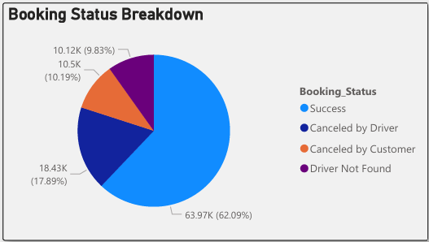
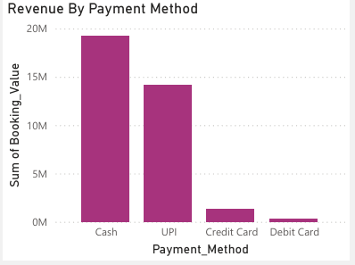
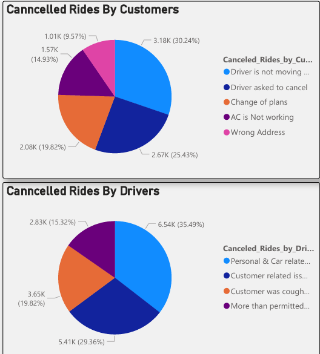
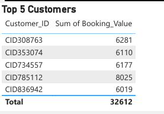

#  OLA Ride Bookings Analysis

## Project Overview
This project analyzes OLA ride booking data to uncover insights into **ride patterns**, **cancellation trends**, **customer & driver ratings**, and **revenue breakdowns**.  
Using **MySQL** for data processing and **Power BI** for visualization, the project highlights areas for operational improvement and customer experience enhancement.

---

##  Tools & Technologies
- **MySQL** – Data cleaning, transformations, and analytical queries  
- **Power BI** – Interactive dashboards & trend visualizations  
- **Excel/CSV** – Data preprocessing  

---

## Dataset Columns
- **Booking Info**: Booking_ID, Booking_Status, Date, Time, Booking_Value, Payment_Method  
- **Ride Info**: Vehicle_Type, Ride_Distance, Pickup_Location, Drop_Location  
- **Customer & Driver**: Customer_ID, Driver_Ratings, Customer_Rating  
- **Cancellations & Incomplete**: cancelled_Rides_by_Customer, cancelled_Rides_by_Driver, Incomplete_Rides, Incomplete_Rides_Reason  

---

## SQL Analysis
Key queries performed:
- Extracted successful bookings and calculated total successful ride value.
- Found top 5 customers by booking value.
- Calculated average ride distance per vehicle type.
- Analyzed cancellations by customers and drivers.
- Segmented revenue by payment method.
- Compared driver and customer rating distributions.

Sample SQL scripts are available in the [`sql_scripts`](ola dataset script.sql) folder.

---

##  Dashboard Visualizations & Insights

### **1. Booking Status Breakdown**
  

**Insight:**  
- 62% of bookings were successful.
- 17% were cancelled by drivers, and 10% by customers — driver cancellations remain the largest operational challenge.
- "Driver Not Found" accounted for ~9.8%, pointing to potential supply-demand mismatch.

---

### **2. Revenue by Payment Method**
  

**Insight:**  
- UPI contributed the largest share of revenue, followed by cash.
- Indicates strong adoption of digital payment systems.
- Opportunity for targeted digital promotions and cashless incentives.

---

### **3. Cancellation Reasons**
  

**Insight:**  
- **Driver-side:** 35% cancellations due to personal & car-related issues — suggests need for operational support and vehicle maintenance programs.
- **Customer-side:** Top reasons include "Driver not moving" and "Driver asked to cancel", highlighting potential training & service quality improvements.

---

### **4. Top 5 Customers**
  

**Insight:**  
- Top 5 customers generated a total booking value of ₹32,612.
- High-value customers can be targeted for loyalty programs and exclusive offers to retain them.

---

## Key Insights Summary
- **Driver cancellations** are the biggest operational issue (35% due to personal/car-related reasons).
- **UPI** is the preferred payment method, suggesting scope for digital-first campaigns.
- **Top customers** contribute significant revenue and are prime candidates for loyalty retention.
- **Booking status trends** highlight opportunities to reduce cancellations and increase successful rides.

---

## Recommendations
- Implement driver support and incentive programs to reduce personal/car-related cancellations.
- Expand digital payment offers and discounts for UPI users.
- Launch targeted campaigns for weekends, when ride volume peaks.
- Create premium packages for high-rating vehicle categories like Prime Sedan.

---

##  How to Run This Project
1. **Run SQL Scripts**  
   Open and execute the SQL scripts in MySQL Workbench to generate aggregated views.
2. **View Dashboard**  
   Open the Power BI dashboard (provided as `OLA_PROJECT.pdf` in this repo).  
   `.pbix` file not uploaded due to GitHub file size restrictions.
3. **Review Insights**  
   Use the dashboard filters to analyze bookings by date range, vehicle type, payment method, and ratings.

---

##  License
This project is released under the MIT License.
